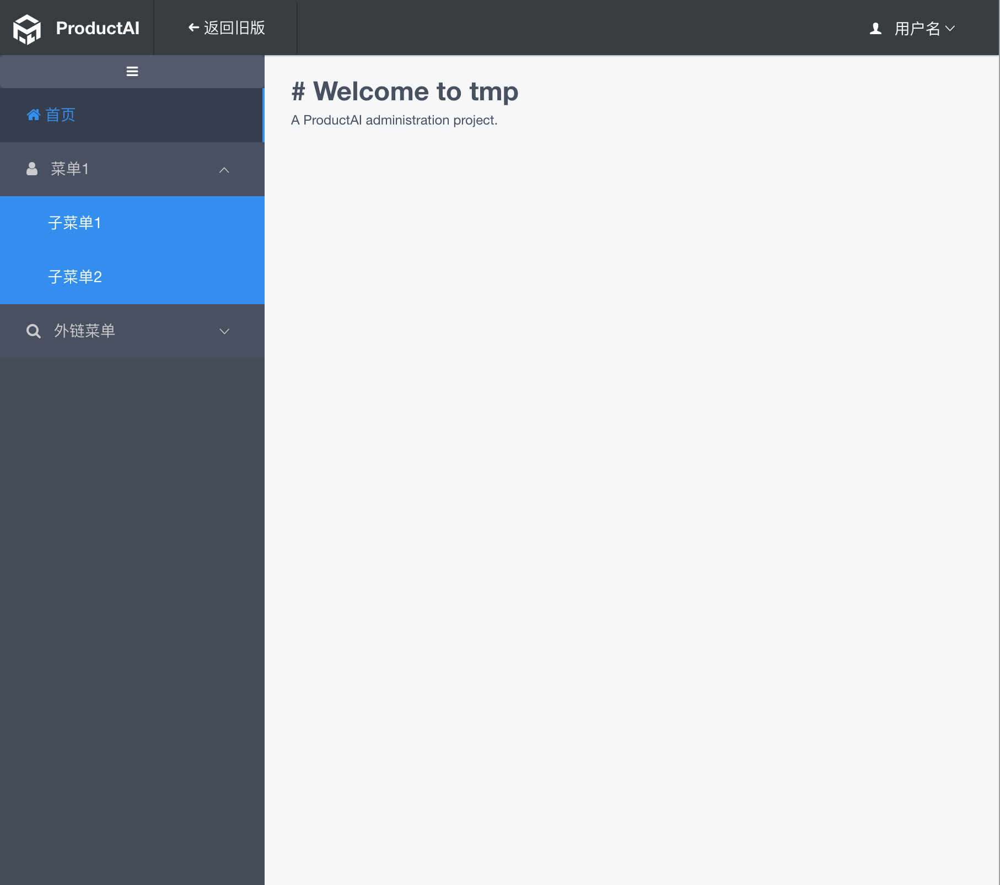

# generator-iview-admin
A yo generator with [iView](https://www.iviewui.com/) from tecvan.

<p align="left">
  <a href="https://www.npmjs.com/package/generator-iview-admin">
    
  </a>

  <a href="https://www.npmjs.com/package/generator-iview-admin">
    
  </a>

  <a href="https://github.com/VanMess/generator-iview-admin/blob/master/LICENSE">
    
  </a>
</p>

## Installation

First, install [Yeoman](http://yeoman.io) and **generator-iview-admin** using [npm](https://www.npmjs.com/) (we assume you have pre-installed [node.js](https://nodejs.org/)).

```bash
npm install -g yo
npm install -g generator-iview-admin
```

Then generate your new project:

```bash
yo iview-admin
```
## What do you get?

Scaffolds out a complete generator directory structure for you:

```
.
├── .gitignore
├── .babelrc
├── .editorconfig
├── .eslintignore
├── .eslintrc.js
├── .gitignore
├── .postcssrc.js
├── index.html
├── package.json
├── README.md
├── build
│   ├── build.js
│   ├── check-versions.js
│   ├── dev-client.js
│   ├── dev-server.js
│   ├── utils.js
│   ├── vue-loader.conf.js
│   ├── webpack.base.conf.js
│   ├── webpack.dev.conf.js
│   ├── webpack.prod.conf.js
│   ├── webpack.test.conf.js
├── config
│   ├── dev.env.js
│   ├── index.js
│   ├── prod.env.js
│   ├── test.env.js
├── src
├── static
├── test
```

## Run the demo

After the installation, we could run script to start server (http://localhost:8080).

```bash
# install dependencies
npm install

# serve with hot reload at localhost:8080
npm run start

# build for production with minification
npm run build

# build for production and view the bundle analyzer report
npm run build --report
```

## Versions

### 1.0.0

Just a simply yo template with: vue iview eslint and karma.
I translate the [vue webpack template](https://github.com/VanMess/webpack) from vue context to yo, and additionally define the base layout like this:

So you could start up CMS liked system more quickly.


## Getting To Know Yeoman

Yeoman has a heart of gold. He's a person with feelings and opinions, but he's very easy to work with. If you think he's too opinionated, he can be easily convinced. Feel free to [learn more about him](http://yeoman.io/).

## License
MIT © tecvan
